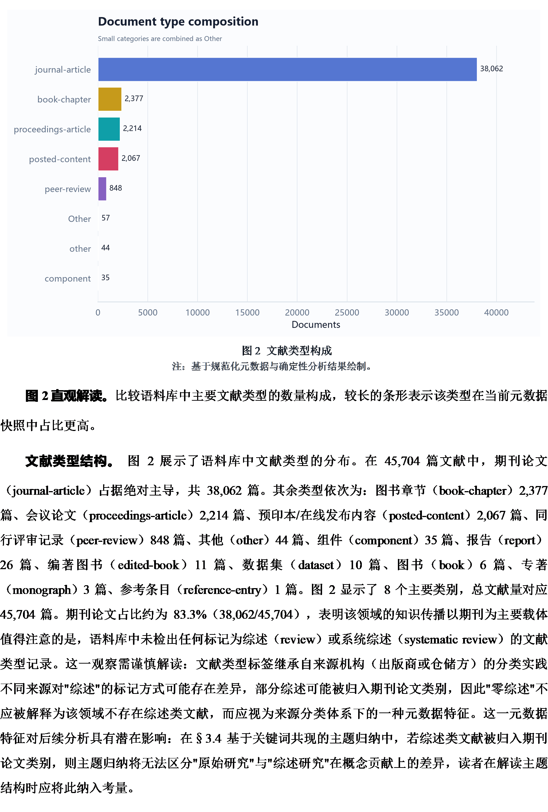
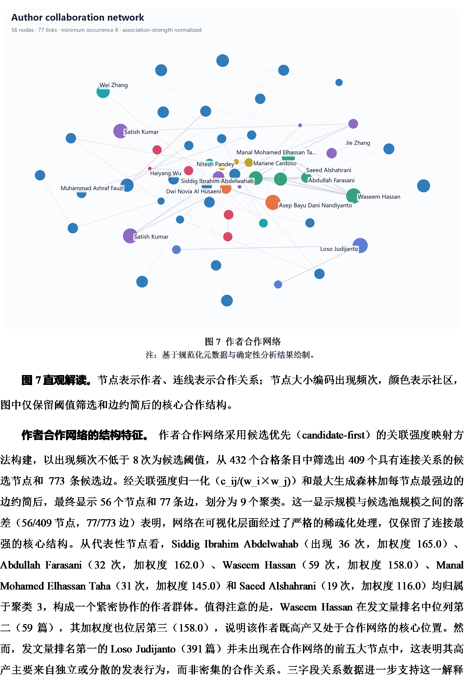
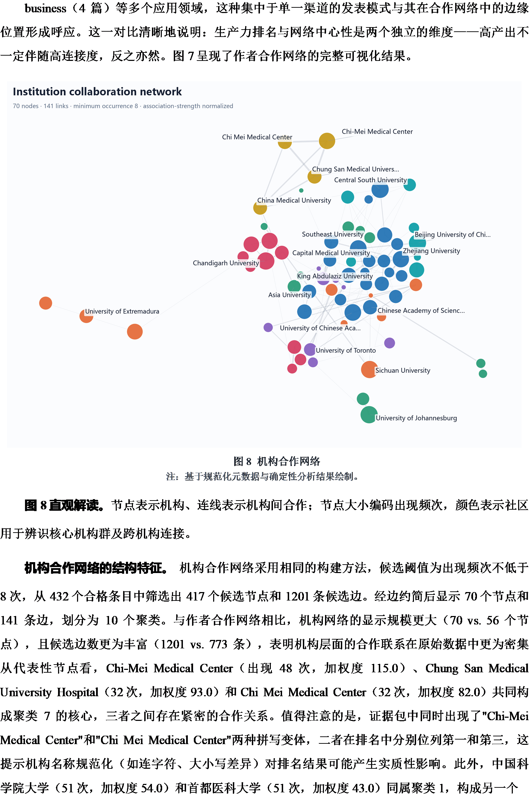
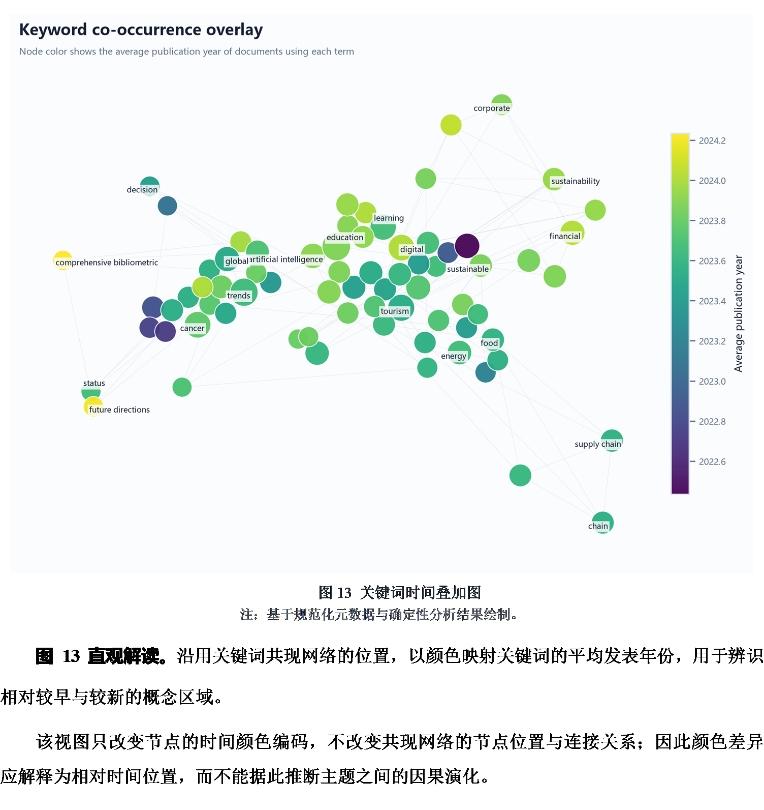
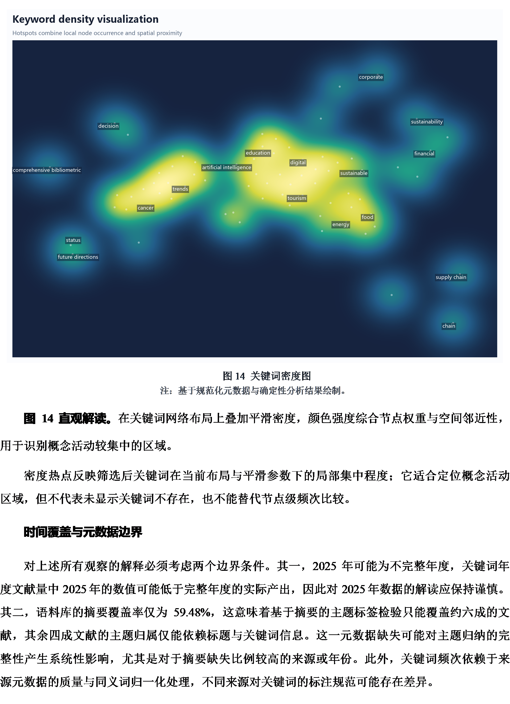
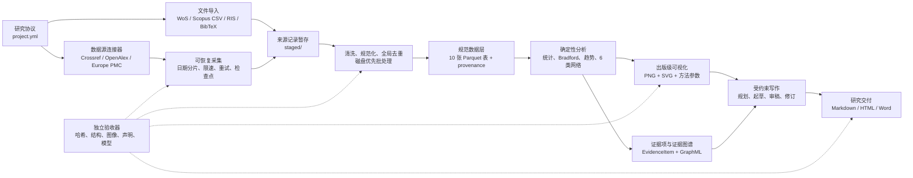

# BibAgent

证据优先、端到端、可审计的文献计量研究 Agent。

BibAgent 把检索协议、合规采集或文件导入、元数据清洗与去重、确定性文献计量分析、出版级可视化、证据绑定、受约束正文生成，以及 HTML/Word 交付组织在同一条可复现流水线上。它既能处理小型研究，也提供面向万级至百万级元数据的磁盘优先处理与可恢复执行路径。

当前流水线：

`研究协议 → 采集/导入 → 清洗去重 → 10 张规范表 → 指标与 6 类网络 → PNG/SVG 图 → 证据图谱 → 分节写作与审稿 → HTML/Word → 独立验收`

## 已生成的 Word 成果

以下截图直接来自最新一次真实端到端运行生成的 43 页 `manuscript.docx`。图表按最终 Word 分页分别展示，并保留图题及相邻结果正文。

[下载完整 Word 示例](examples/bibliometric-report-example.docx)

### 统计分布与来源分析



### 作者合作网络



### 机构合作网络



### 关键词时间叠加图



### 关键词密度图



## 架构



### 代码分层

| 层 | 主要模块 | 职责 |
| --- | --- | --- |
| 接口与编排 | `cli.py`、`api.py`、`workflow.py` | CLI/API 入口、状态流转、断点续跑与阶段编排 |
| 数据接入 | `connectors/`、`bulk_acquisition.py` | 开放数据源、文件导入、分片采集、游标与检查点 |
| 数据工程 | `transform.py`、`bulk_processing.py`、`quality.py` | 字段规范化、实体去重、关系重映射、质量门禁 |
| 分析与互操作 | `analytics.py`、`scalable_reporting.py`、`interoperability.py` | 指标、网络、bibliometrix 和 VOSviewer 导出 |
| 可视化 | `visualization.py`、`large_scale_visualization.py` | 全量统计、受控稀疏网络、确定性布局、PNG/SVG |
| 证据与写作 | `evidence.py`、`generation.py` | 证据项、声明绑定、分节生成、专家审稿与修订 |
| 交付 | `word_export.py` | 学术论文版 Word、内嵌图、图题、参考文献和页码 |
| 验收 | `*_acceptance.py`、`acceptance.py` | 对采集、处理、可视化、Word 和正文进行独立复算 |

### 数据分层

一次运行会在项目目录中生成以下研究包：

```text
my-study/
├── project.yml                  # 版本化研究协议
├── raw/                         # 不可变 API 响应或原始导入文件
├── staged/                      # 来源级记录
├── canonical/                   # 10 张规范 Parquet 表
├── quality/                     # 字段覆盖率、可分析性与排除记录
├── analyses/                    # 统计表、网络节点/边与方法参数
│   └── exports/                 # bibliometrix / VOSviewer 互操作文件
├── figures/                     # 高分辨率 PNG 与可编辑 SVG
├── evidence/                    # 证据项、声明台账、GraphML
├── report/                      # Markdown、HTML、Word 与生成阶段
└── audit/                       # 状态、哈希、清单和自动验收报告
```

`runs/` 默认不进入 Git。研究数据和中间产物通常体积较大，也可能受到数据库许可约束；仓库只保存代码、测试、公开运行手册、经过筛选的演示截图和一个最终 Word 示例。内部开发计划、冻结参考语料及文本抽取中间量同样不进入仓库。

## 安装

要求 Python 3.11 或更高版本，推荐 Python 3.12。所有命令都应在独立虚拟环境中运行。

### Windows PowerShell

```powershell
git clone https://github.com/ruoyuanwang/Ragent-report.git
cd Ragent-report

py -3.12 -m venv .venv
.\.venv\Scripts\python.exe -m pip install -U pip
.\.venv\Scripts\python.exe -m pip install -e ".[dev]"
```

### macOS / Linux

```bash
git clone https://github.com/ruoyuanwang/Ragent-report.git
cd Ragent-report

python3.12 -m venv .venv
source .venv/bin/activate
python -m pip install -U pip
python -m pip install -e ".[dev]"
```

需要 LLM 写作时设置 DeepSeek 密钥；OpenAlex 密钥可选，Crossref 建议提供可联系邮箱：

```powershell
$env:DEEPSEEK_API_KEY="<your-key>"
$env:OPENALEX_API_KEY="<optional-openalex-key>"
$env:CROSSREF_MAILTO="researcher@example.org"
```

密钥只通过环境变量传入，不要写进 `project.yml`、源码或日志。

## 快速运行

### 1. 一条命令完成研究

不加 `--llm` 时仍会完成采集、分析、可视化、证据和模板化报告；加上 `--llm` 后执行受约束写作与审稿。

```powershell
.\.venv\Scripts\bibagent.exe quickstart runs\my-study `
  --title "Large language models and bibliometrics" `
  --keyword "large language model" `
  --keyword "bibliometric" `
  --from 2022 --to 2026 `
  --source europe_pmc `
  --llm `
  --review-rounds 1
```

开放数据源可选 `crossref`、`openalex`、`europe_pmc`。

### 2. 先审查协议，再执行

```powershell
.\.venv\Scripts\bibagent.exe init runs\my-study `
  --title "My topic" `
  --keyword "term one" `
  --keyword "term two" `
  --from 2020 --to 2026 `
  --source openalex

# 审查并按需修改 runs\my-study\project.yml
.\.venv\Scripts\bibagent.exe run runs\my-study --llm
```

### 3. 导入 WoS、Scopus、RIS 或 BibTeX

对于受许可约束的数据源，请先在数据库界面导出完整记录与参考文献，再导入 BibAgent。系统不会绕过登录、验证码或数据库服务条款。

```powershell
.\.venv\Scripts\bibagent.exe quickstart runs\wos-study `
  --title "Imported bibliometric study" `
  --keyword "bibliometric" `
  --from 2015 --to 2026 `
  --source import_file `
  --input-file D:\data\savedrecs.txt `
  --input-format wos `
  --llm
```

`--input-format` 支持 `auto`、`csv`、`ris`、`bibtex`、`wos`。CSV 映射兼容 WoS、Scopus 和通用字段名；导入记录数、筛选数与原文件 SHA-256 会进入采集清单。

## 大规模运行

热门主题或大时间跨度研究可启用 bulk 模式。采集器先按来源报告数自适应切分日期范围，再分页压缩落盘，并在每一页后更新检查点。

```powershell
.\.venv\Scripts\bibagent.exe init runs\bulk-study `
  --title "Bibliometric metadata 2020-2025" `
  --keyword "bibliometric" `
  --mode phrase `
  --from 2020 --to 2025 `
  --source crossref `
  --bulk `
  --target-slice-records 10000

# 可选：只下载两页，用于演练中断恢复
.\.venv\Scripts\bibagent.exe harvest runs\bulk-study --page-budget 2

# 继续采集并逐阶段验收
.\.venv\Scripts\bibagent.exe harvest runs\bulk-study
.\.venv\Scripts\bibagent.exe harvest-accept runs\bulk-study
.\.venv\Scripts\bibagent.exe process runs\bulk-study
.\.venv\Scripts\bibagent.exe process-accept runs\bulk-study
.\.venv\Scripts\bibagent.exe visualize runs\bulk-study
.\.venv\Scripts\bibagent.exe visualize-accept runs\bulk-study
```

Europe PMC 和 OpenAlex 从已保存游标继续；Crossref 重启未完成的最小日期分片，以规避服务端滚动游标过期。处理阶段采用有界内存批次、磁盘分区和全局去重；重新执行同一命令即可从清单恢复。

详细设计：

- [大规模元数据采集手册](docs/LARGE_SCALE_ACQUISITION.md)
- [大规模清洗、去重与结构化手册](docs/LARGE_SCALE_PROCESSING.md)
- [大规模文献计量可视化手册](docs/SCALABLE_VISUALIZATION.md)

## 继续写作与导出

已有分析结果时，不必重新采集或计算：

```powershell
# 从生成阶段继续
.\.venv\Scripts\bibagent.exe resume runs\my-study

# 根据证据和审稿意见逐节修订
.\.venv\Scripts\bibagent.exe refine runs\my-study

# 单独重新导出 Word
.\.venv\Scripts\bibagent.exe word runs\my-study `
  --output runs\my-study\report\manuscript.docx `
  --native-word
```

`--native-word` 仅适用于装有 Microsoft Word 的 Windows 环境，会在交付前通过 Word 原生保存一次，以减少不同 Word 版本首次打开时的字体和分页差异。

## 本地 API

```powershell
.\.venv\Scripts\bibagent.exe serve --host 127.0.0.1 --port 8000
```

启动后访问 `http://127.0.0.1:8000/docs` 查看 OpenAPI 交互文档。主要接口包括：

- `GET /health`
- `POST /v1/projects/run`
- `POST /v1/projects/process`
- `GET /v1/projects/process/accept`
- `POST /v1/projects/visualize`
- `GET /v1/projects/visualize/accept`

## 可审计与低幻觉机制

- LLM 不直接自由读取元数据后“总结”；数值、比例、排名和网络结果先由确定性代码计算。
- 正文中的实证声明必须绑定到存在的 `EvidenceItem`。
- 数字必须来自证据包，禁止模型自行计算或补写。
- DOI 必须来自批准的方法文献或采集元数据。
- 共现、共被引和合作网络不会被表述为因果关系。
- 失败草稿保存在 `audit/generation_candidates/`，不会覆盖已通过门禁的正式正文。
- 原始快照、规范表、分析表、图、证据和正文声明之间保留可遍历 provenance。

## 测试与验收

```powershell
.\.venv\Scripts\python.exe -m pytest -q
.\.venv\Scripts\ruff.exe check src tests

# 完整研究包验收
.\.venv\Scripts\bibagent.exe accept runs\my-study

# 合成规模基准
.\.venv\Scripts\bibagent.exe benchmark `
  --documents 1000000 `
  --terms-per-document 5 `
  --output runs\benchmark-1m.json
```

独立验收覆盖采集完整性、原始文件哈希、规范表结构与主外键、输入守恒、图像尺寸与哈希、网络选择披露、可复现布局、互操作导出、证据路径、正文声明和指定生成模型。

## 开发约定

- 业务规则进入源码和测试，不靠手工修改运行结果。
- `runs/`、`.venv/`、缓存、密钥和构建产物不提交到 Git。
- 内部计划、基准参考语料和抽取文本保留在本地，不发布到远端。
- 新增流水线阶段时，同时提供状态清单、可恢复语义和独立验收器。
- 修改后至少运行 `pytest` 与 `ruff`；涉及 Word 或图表时同时进行视觉检查。

本项目使用 Apache-2.0 许可证声明，当前版本号为 `0.1.0`。
