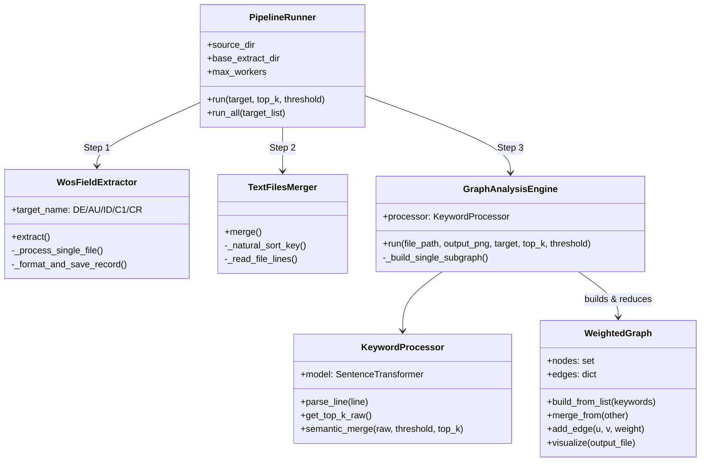
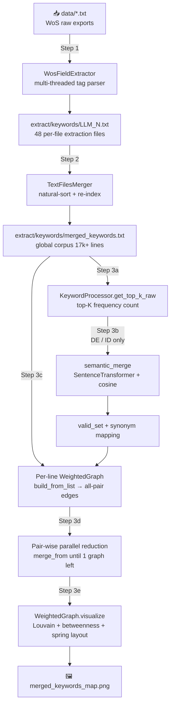
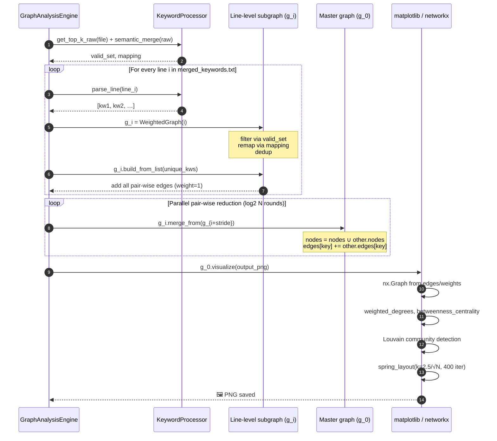

# Paper Mining ⛏

> A lightweight WoS (Web of Science) bibliographic mining toolkit — extract structured fields from raw WoS export files, merge & normalize them across batches, then turn them into **CiteSpace-style** co-occurrence knowledge graphs.

## Purpose 👀
- 🔍 **Extract** structured fields (keywords, authors, countries, references …) from Web-of-Science plain-text exports.
- 🔗 **Merge & Normalize** extracted fragments across dozens of batch files into a single re-indexed corpus.
- 🌐 **Semantically cluster** high-frequency terms via `SentenceTransformer`, then build a **weighted co-occurrence graph**.
- 🎨 **Visualize** the graph with **Louvain community detection** + **betweenness centrality rings** in a CiteSpace-like dark-themed map.

---

## 📁 Project Structure

```
Paper-Mining/
├── run_process.py                # 🚀 Pipeline entry: PipelineRunner (Extract → Merge → Analyze)
├── test_run_process.py           # ✅ End-to-end unittest suite (TestRealDataKeywordPipeline etc.)
│
├── FileProcess/                  # Step 1 & 2: raw-file I/O layer
│   ├── file_extract.py           #   - WosFieldExtractor : multi-threaded WoS field parser
│   ├── file_merge.py             #   - TextFilesMerger   : natural-sort concat + re-indexer
│   └── file_clean.py             #   - (reserved)
│
├── utils/                        # Shared helpers
│   ├── constant.py               #   - DIR_MAPPING, DOI_PATTERN_STR
│   └── processor.py              #   - KeywordProcessor : parse_line / get_top_k_raw / semantic_merge
│
├── entity/                       # Step 3 core domain object
│   └── graph.py                  #   - WeightedGraph : nodes/edges + merge_from() + visualize()
│
├── visualize/                    # Step 3 orchestration
│   └── analysis.py               #   - GraphAnalysisEngine : top-k → semantic merge → subgraph build → parallel reduce → plot
│
├── data/                         # 📥 INPUT  — raw WoS exports (LLM 1.txt … LLM 48.txt)
└── extract/                      # 📤 OUTPUT — per-field sub-dirs
    ├── keywords/    (← DE)
    ├── authors/     (← AU)
    ├── digitwords/  (← ID)
    ├── country/     (← C1)
    └── reference/   (← CR)
```

---

## 🏗️ Code Architecture

The project follows a **3-stage pipeline** orchestrated by `PipelineRunner` in [run_process.py](run_process.py). Each stage is an independently-usable class:

| Stage | Class | File | Responsibility |
|:-:|---|---|---|
| 1 | `WosFieldExtractor` | `FileProcess/file_extract.py` | Thread-pooled parse of WoS tags (`DE / AU / ID / C1 / CR`) from every `.txt` in `data/`; writes per-file extraction into `extract/<sub_dir>/`. |
| 2 | `TextFilesMerger`   | `FileProcess/file_merge.py`   | Natural-sort concatenates the extracted files, strips per-file indices, re-assigns a global line index → `merged_<field>.txt`. |
| 3a | `KeywordProcessor` | `utils/processor.py`          | `parse_line()` / `get_top_k_raw()` word-frequency; `semantic_merge()` clusters synonyms via `all-MiniLM-L6-v2` + cosine similarity (threshold 0.7). |
| 3b | `WeightedGraph`    | `entity/graph.py`             | Domain entity. Builds fully-connected sub-graphs per line, supports `merge_from()`, renders CiteSpace-style PNG via `networkx` + Louvain. |
| 3c | `GraphAnalysisEngine` | `visualize/analysis.py`    | Glues 3a + 3b: multi-threaded sub-graph construction + **pair-wise parallel reduction** down to one master graph, then `visualize()`. |

### Class Diagram



---

## 🔄 Workflow

Whole end-to-end pipeline launched by a single call `pipeline.run('DE', top_k=300, threshold=0.7)`:



**Stepwise detail**

1. **Extract** — `WosFieldExtractor` scans each raw `.txt`, streams line-by-line and watches for a 2-letter WoS tag (e.g. `DE`, `AU`). Continuation lines (starting with a space/tab) are accumulated until the next record tag, then flushed in the canonical `[item1], [item2], …` format.
2. **Merge** — `TextFilesMerger` walks the output directory in **natural order** (`LLM 2.txt` before `LLM 10.txt`), strips the per-file local index prefix via regex `^\d+\s*[.、]?\s*(.*)`, and rewrites every record with a **global increasing index** into `merged_<field>.txt`.
3. **Analyze**
   - 3a. `get_top_k_raw` — concurrent `parse_line` + `Counter.most_common(top_k)` to obtain the 300 most frequent tokens.
   - 3b. `semantic_merge` *(DE & ID only)* — encodes tokens via `all-MiniLM-L6-v2`, builds a cosine-similarity matrix, greedily groups items with `score ≥ threshold`, picks the highest-frequency word as the cluster representative. Produces `valid_set` + `mapping`.
   - 3c. For every input line, spawn a thread → parse → filter by `valid_set` → apply `mapping` → `WeightedGraph.build_from_list()` creates a fully-connected sub-graph.
   - 3d. **Parallel binary reduction** — iteratively fold the sub-graph array in halves using multi-threaded `merge_from` until a single master graph remains (log₂N depth).
   - 3e. `visualize()` produces the final dark-themed PNG with Louvain communities, citation-ring halos for high-centrality nodes, log-scaled node radii, and collision-aware label placement.

---

## 📊 Data Flow of a Core Object — `WeightedGraph`

`WeightedGraph` is the central domain entity used through the whole analysis pipeline. Its lifecycle:



**Core invariants**
- `self.nodes : set[str]` — deduplicated vocabulary.
- `self.edges : dict[tuple(sorted(u,v)), int]` — symmetric edge weight accumulator; `add_edge` is idempotent w.r.t. ordering.
- `merge_from()` is **associative & commutative** → safe for parallel reduction.
- Self-loops are rejected (`if u == v: return`).

---

## 📑 WoS Data Format — Field Cheat Sheet

Each WoS export is an ASCII file. Records are delimited by `PT ...` (record start) and `ER` (end of record). Every line begins with a **2-letter field tag**, and wrapped/continuation lines start with whitespace.

| Tag | Meaning | Example | Used by this project |
|:-:|---|---|:-:|
| `FN` | File Name / Source of export | `FN Clarivate Analytics Web of Science` | |
| `VR` | Version of file format | `VR 1.0` | |
| `PT` | Publication Type | `PT J` (Journal) | |
| `AU` | **Authors** (short form) | `AU Abosi, OJ` | ✅ `AU → extract/authors/` |
| `AF` | Authors (full form) | `AF Abosi, Oluchi J.` | |
| `TI` | Title | `TI A head-to-head comparison…` | |
| `SO` | Source (journal name) | `SO INFECTION CONTROL & HOSPITAL EPIDEMIOLOGY` | |
| `LA` | Language | `LA English` | |
| `DT` | Document Type | `DT Article` | |
| `DE` | **Author Keywords** | `DE large language models; healthcare; ...` | ✅ `DE → extract/keywords/` |
| `ID` | **KeyWords Plus** (WoS-generated index terms) | `ID COVID-19` | ✅ `ID → extract/digitwords/` |
| `AB` | Abstract | `AB We investigated the accuracy…` | |
| `C1` | **Author Address / Affiliation** (last comma segment ⇒ country) | `C1 [Abosi, …] Univ Iowa Hlth Care, Iowa City, IA 52242 USA.` | ✅ `C1 → extract/country/` |
| `C3` | Enhanced Organization Name | `C3 University of Iowa; Stanford University` | |
| `RP` | Reprint Address | `RP Abosi, OJ (corresponding author)…` | |
| `EM` | Author Email | `EM oluchi-abosi@uiowa.edu` | |
| `RI` | ResearcherID | `RI Ross, Natalie/KPA-5307-2024` | |
| `OI` | ORCID | `OI Rodriguez-Nava, Guillermo/0000-0001-9826-7050` | |
| `CR` | **Cited References** (DOI extracted via regex) | `CR Alsuhaibani M, 2022, …, DOI 10.1016/j.ajic.2021.11.015` | ✅ `CR → extract/reference/` |
| `NR` | Cited Reference Count | `NR 10` | |
| `TC` / `Z9` | Times Cited (WoS / all DBs) | `TC 0` | |
| `U1` / `U2` | Usage Count (180 days / since 2013) | `U1 0` | |
| `PU` / `PI` / `PA` | Publisher / City / Address | `PU CAMBRIDGE UNIV PRESS` | |
| `SN` / `EI` | ISSN / eISSN | `SN 0899-823X` | |
| `J9` / `JI` | Journal abbreviations | `J9 INFECT CONT HOSP EP` | |
| `PD` / `PY` | Publication Date / Year | `PD MAR` / `PY 2025` | |
| `VL` / `IS` | Volume / Issue | `VL 46` / `IS 3` | |
| `BP` / `EP` / `PG` | Begin page / End page / Page count | `BP 309` `EP 311` `PG 3` | |
| `DI` | **DOI** | `DI 10.1017/ice.2024.205` | |
| `WC` / `SC` | Web of Science Categories / Research Areas | `WC Public, Environmental…` | |
| `WE` | WoS Edition / Index | `WE Science Citation Index Expanded (SCI-EXPANDED)` | |
| `UT` | **Unique Accession Number** (record ID) | `UT WOS:001376757200001` | |
| `PM` | PubMed ID | `PM 39664019` | |
| `OA` | Open Access status | `OA Green Submitted, hybrid` | |
| `DA` | Date this record was generated | `DA 2025-10-16` | |
| `ER` | **End of Record** | `ER` | (delimiter) |
| `EF` | End of File | `EF` | (delimiter) |

### Supported extraction targets → output mapping

Defined in [utils/constant.py](utils/constant.py):

```python
DIR_MAPPING = {
    "DE": "keywords",    # Author keywords          — semantic merge ON
    "ID": "digitwords",  # KeyWords Plus            — semantic merge ON
    "AU": "authors",     # Authors                  — raw co-authorship
    "C1": "country",     # Country (from address)   — last-segment country extraction
    "CR": "reference",   # Cited references (DOIs)  — regex 10.\d{4,9}/[^\s,\]]+
}
```

---

## 🚀 Quick Start

```bash
# 1. Install dependencies
pip install numpy networkx matplotlib tqdm sentence-transformers

# 2. Place raw WoS exports under ./data/ (files may be named freely, e.g. "LLM 1.txt")

# 3. Run the full pipeline for all 4 targets
python3 run_process.py

# 4. Or run a single field programmatically
python3 -c "from run_process import PipelineRunner; \
            PipelineRunner('./data', './extract', max_workers=100).run('DE', top_k=300, threshold=0.7)"

# 5. Run end-to-end tests
python3 -m unittest test_run_process.TestRealDataKeywordPipeline -v
```

Outputs are written to `extract/<sub_dir>/`:
- `LLM N.txt` — per-file extraction
- `merged_<field>.txt` — consolidated corpus
- `merged_<field>_map.png` — CiteSpace-style co-occurrence graph

---

## 🧭 Track
- **v0.1** — first commit of *paper-mining*, delivering the basic triplet of `extract / merge / visualize`.

## 🛣️ ToDo
- [ ] Visualize Format Dingding...
